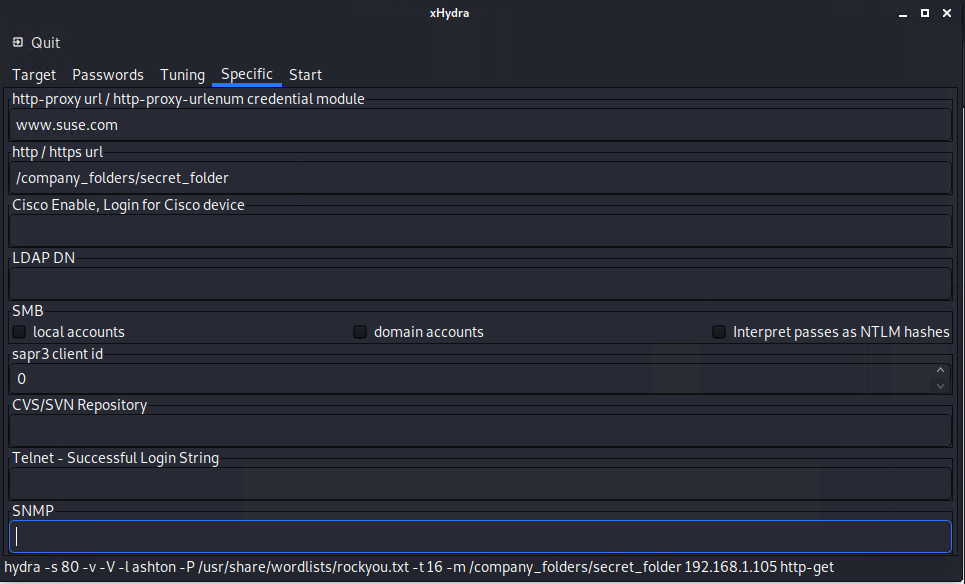
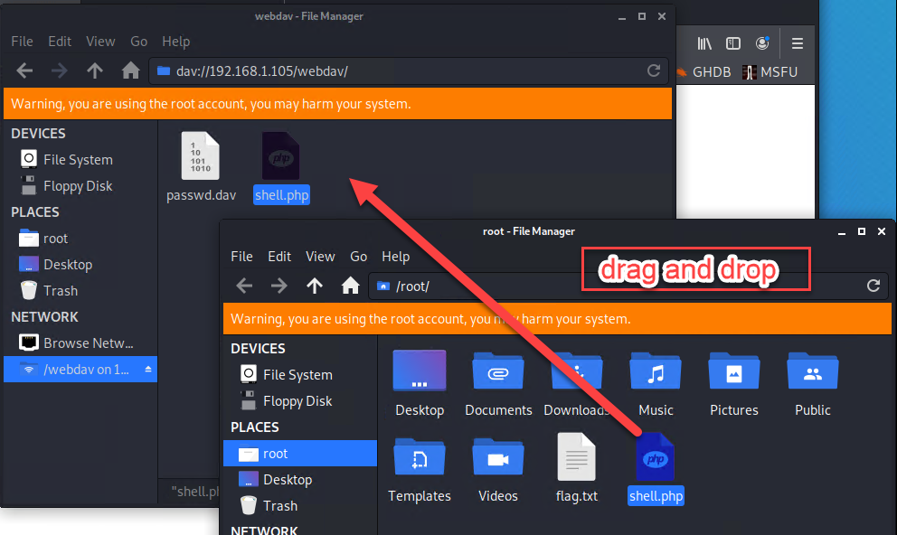

## Day 1 Activity File: Red Team

Today, you will act as an offensive security Red Team to exploit a vulnerable Capstone VM (`192.168.1.105`).

You will need to use the following tools, in no particular order:
- Firefox
- Hydra
- Nmap
- Metasploit

### Instructions

Complete the following to find the flag:

- Discover the IP address of the Linux server.

- Locate the hidden directory on the server.

- Brute force the password for the hidden directory using the hydra command:

- Break the hashed password with Crackstation website.

- Connect to the server via WebDAV.

- Upload a PHP reverse shell payload.

- Find and capture the flag.

After you have captured the flag, show it to your instructor.

Be sure to save important files (e.g., scan results) and take screenshots as you work through the assessment. You'll use them again when creating your presentation.

---
© 2020 Trilogy Education Services, a 2U, Inc. brand. All Rights Reserved.
