## Day 3 Activity File: Reporting

The report summarizes my work in a presentation containing the following sections:

- **Network Topology**
    - What are the addresses and relationships of the machines involved?  

- **Red Team**
  - What were the three most critical vulnerabilities you discovered?
    - Choose the three vulnerabilities that _you_ consider to be most critical.

- **Blue Team**
  - What evidence did you find in the logs of the attack?
  - What data should you be monitoring to detect these attacks next time?

- **Mitigation**
  - What alarms should you set to detect this behavior next time?
  - What controls should you  put in place on the target to prevent the attack from happening?

### Instructions

Open the template on Google Slides: [Project 2 Report in PPT format](https://docs.google.com/presentation/d/1dw-dcEamULvWQUJZKOgrQf9KGAD4b6yQA-oARlb0Nkw/edit?usp=sharing)

- Alternatively, the slide images are pasted below

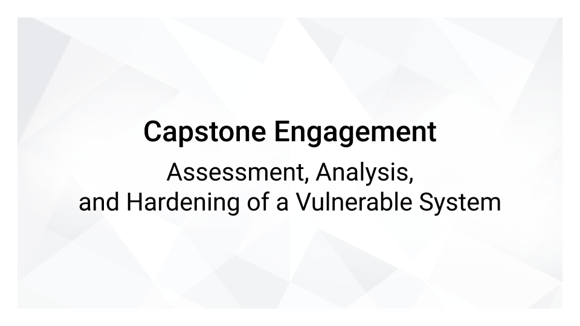

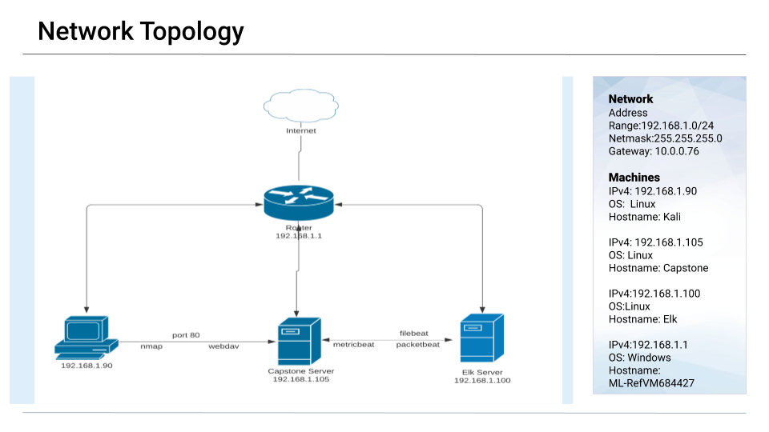
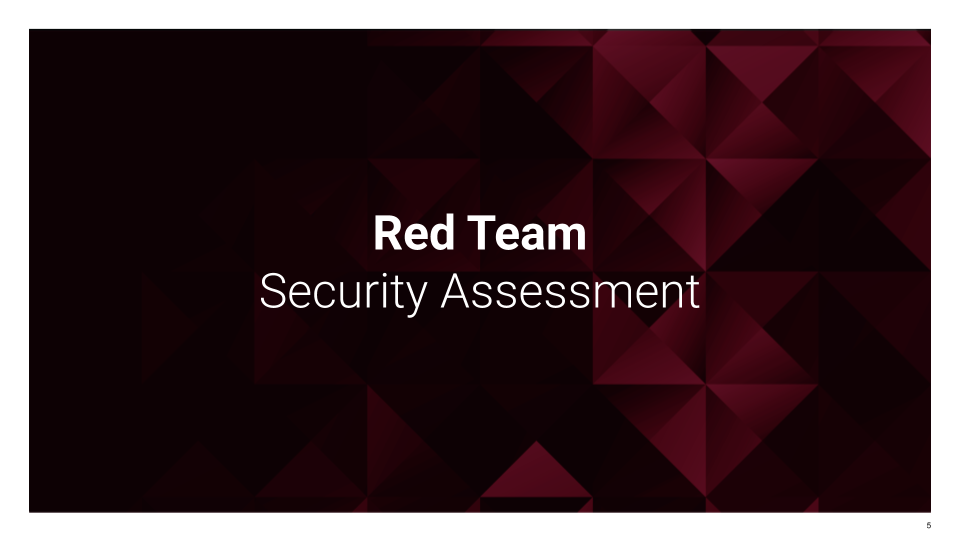
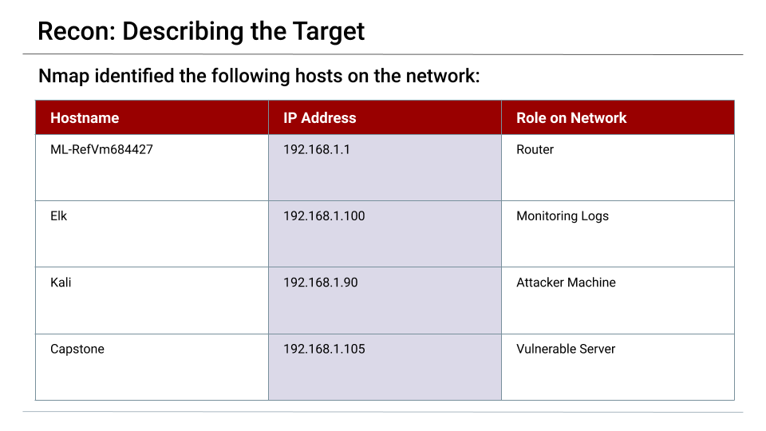
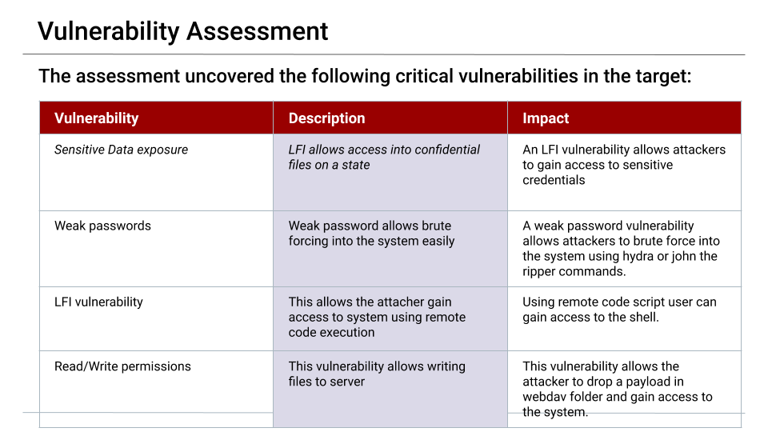
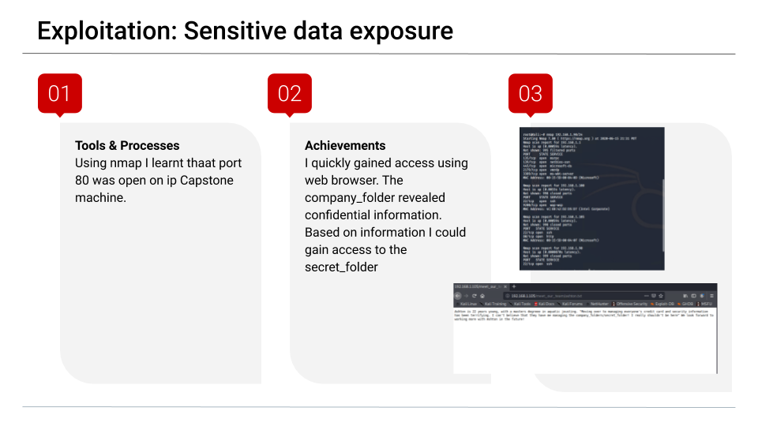
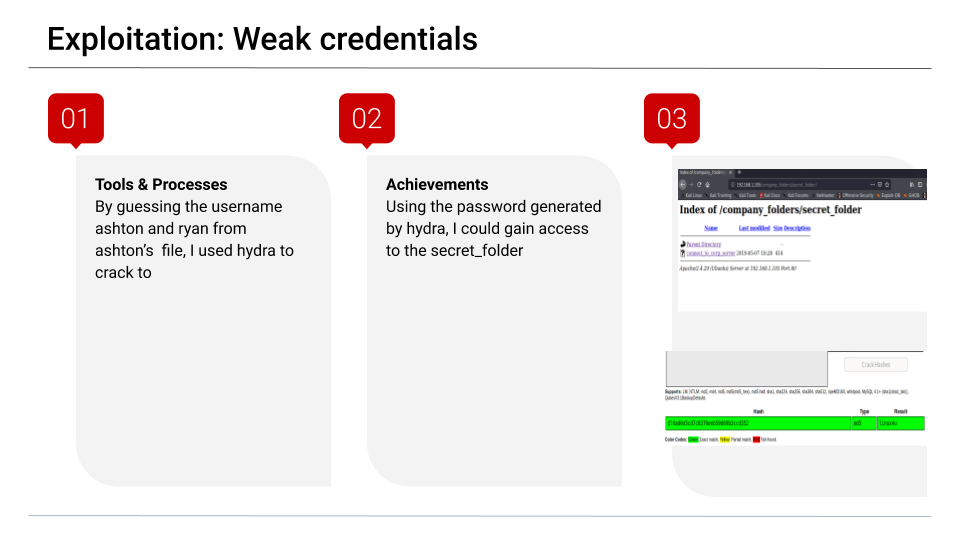
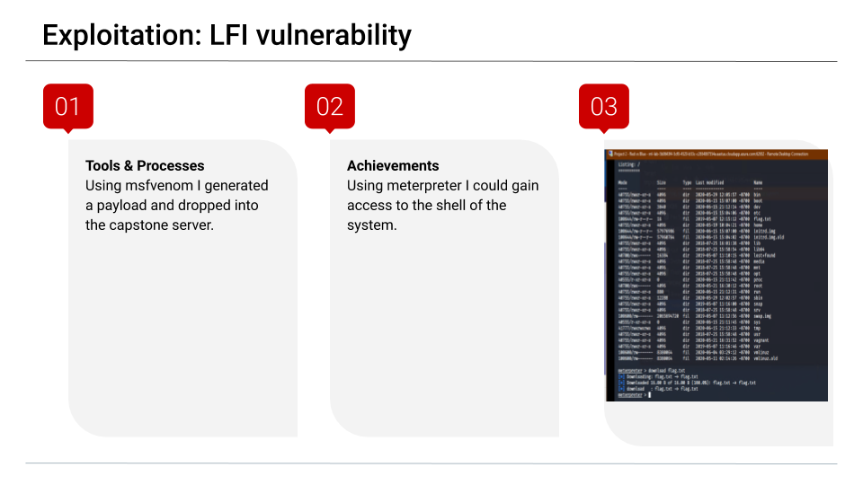
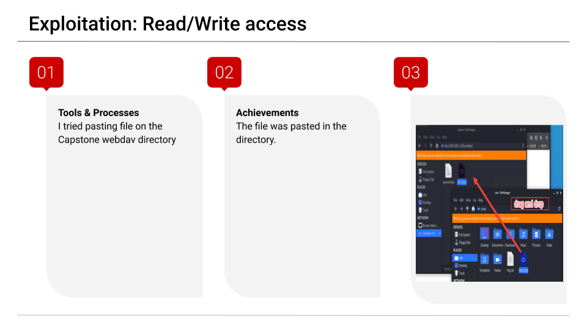
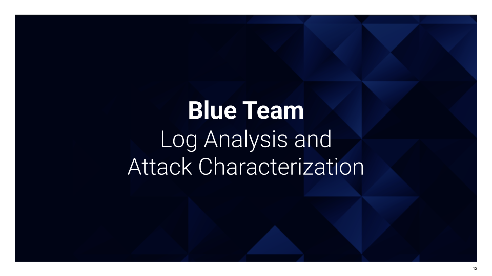

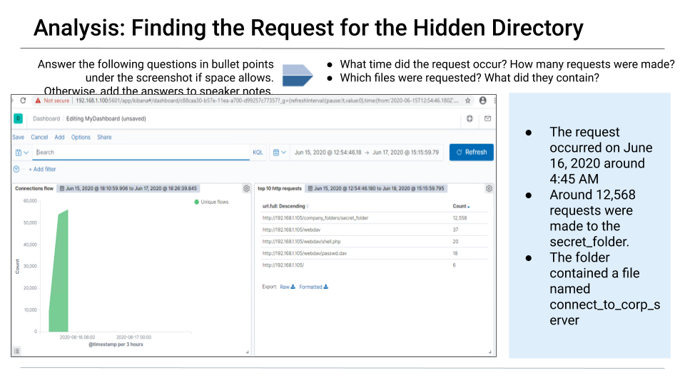
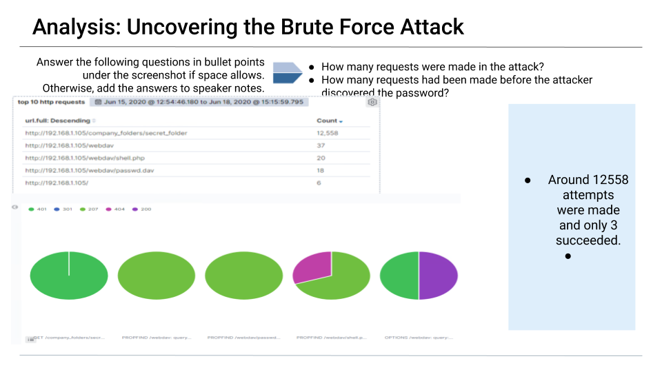
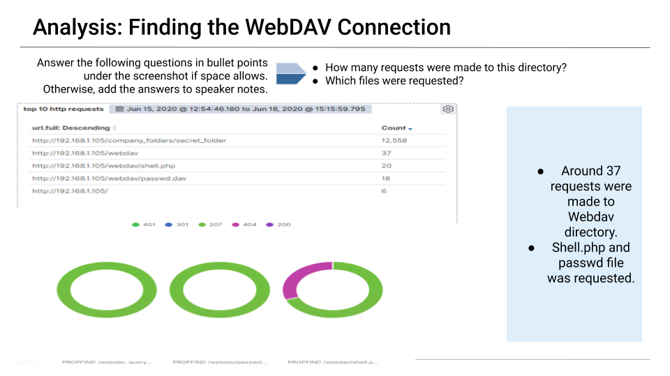
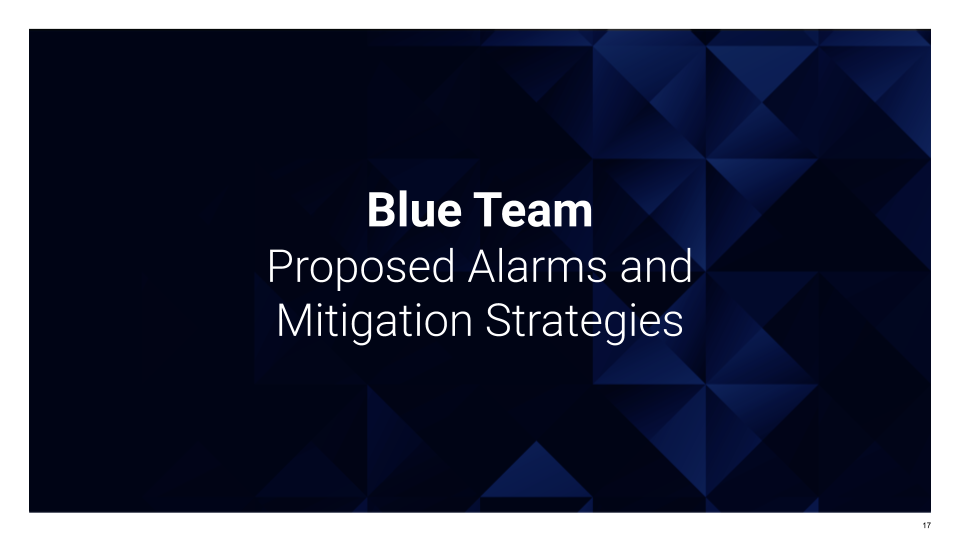
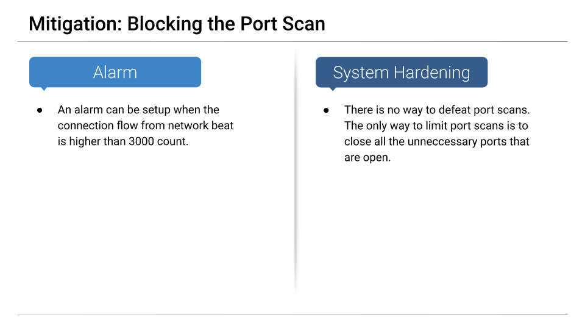
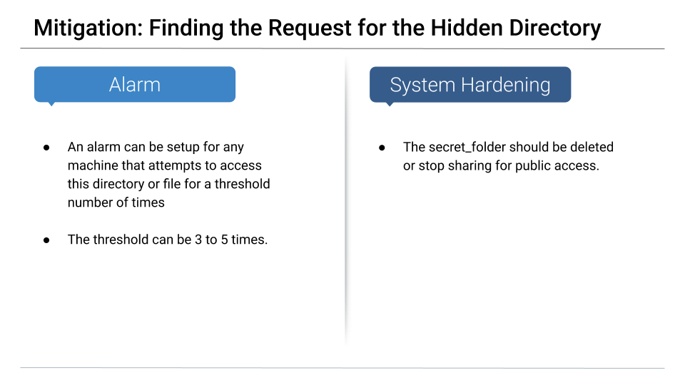
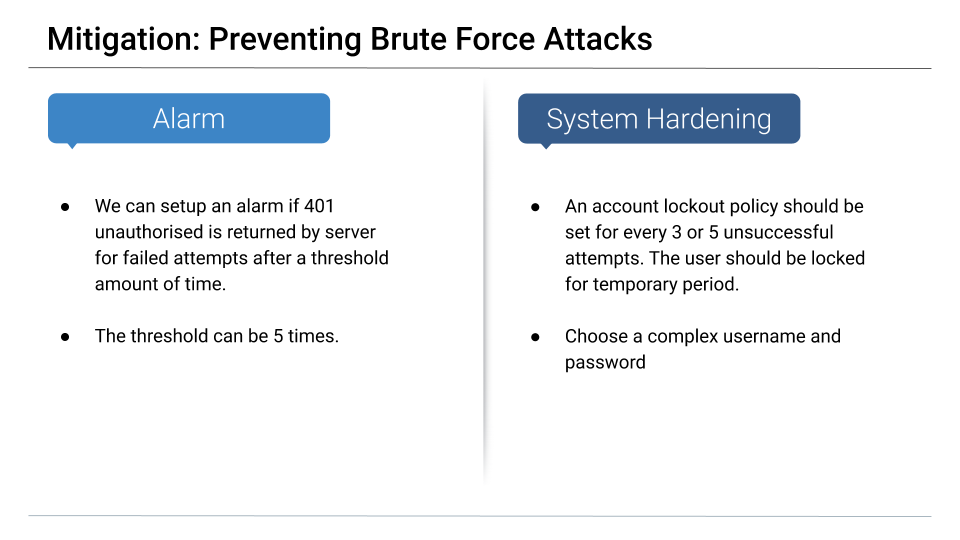
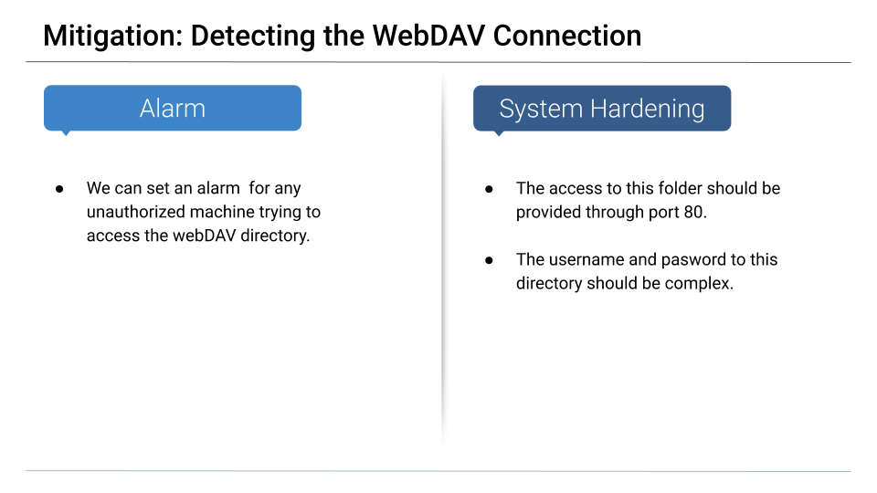
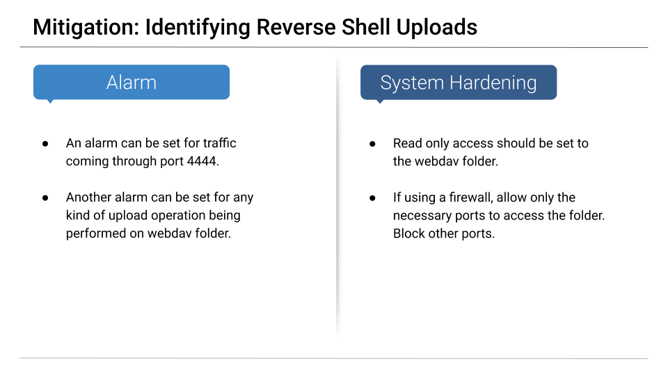

---
